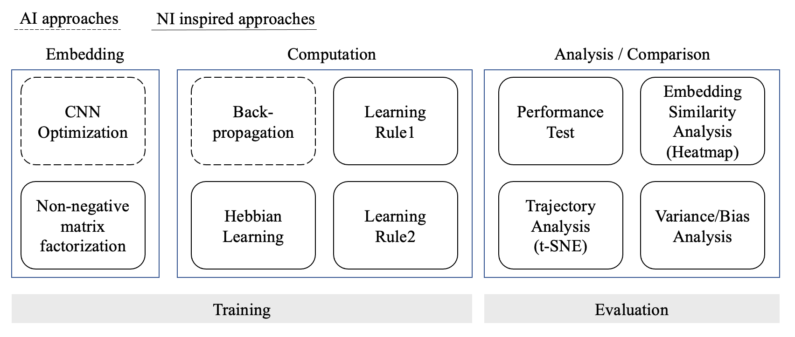

# Microlearning Project

- Members: Jeeyoung Yoon, Elisee Amegassi, Ian Deal, Shinvanshu Srivastava, Victor Martins, Stephen Chen, Sungjae Cho

## First proposal

Our project is about evaluating the effect that learning rules have on how neural networks internally represent data and how this affects downstream tasks.
We are particularly interested in evaluating how increasingly biologically plausible learning rules affect these representations.

Towards this goal we will be asking:
1. Comparing artificial and biology inspired data embedding methods (how models represent data in the initial layer) and measure this affects task performance?
2. How do different biologically plausible learning rules affect internal representations of a set of models performing the same task? Especially, will a learning rule based on local weight adjustments significantly change what features are represented compared to backprop.
3. How do networks that are trained with biologically plausible learning rules compare to data collected from human image recognition tasks?

To do this we will be constructing a standard network architecture and training it to perform multiple tasks. For each task, an instance of the model will be trained with each of our selected learning rules and a set of metrics will be computed comparing each instance's representations and task performance.



## Baseline model

```python
# @title MNIST Model
# modified and reorganized from https://github.com/pytorch/examples/blob/main/mnist/main.py
#lenet model
# Dropout has been left out.
class Net(nn.Module):
    def __init__(self):
        super(Net, self).__init__()
        self.conv1 = nn.Conv2d(1, 32, 3, 1)
        self.conv2 = nn.Conv2d(32, 64, 3, 1)
        #self.dropout1 = nn.Dropout(0.25)
        #self.dropout2 = nn.Dropout(0.5)
        self.fc1 = nn.Linear(9216, 128)
        self.fc2 = nn.Linear(128, 10)

    def forward(self, x):
        x = self.conv1(x)
        x = F.relu(x)
        x = self.conv2(x)
        x = F.relu(x)
        x = F.max_pool2d(x, 2)
        #x = self.dropout1(x)
        x = torch.flatten(x, 1)
        x = self.fc1(x)
        x = F.relu(x)
        #x = self.dropout2(x)
        x = self.fc2(x)
        output = F.log_softmax(x, dim=1)
        return output
```